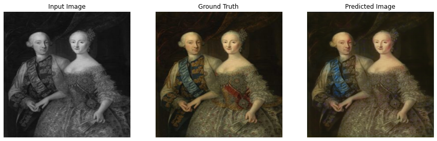

# Painting-Colorizer

To colorize black and white paintings, a Conditional Generative Adversarial Neural Network (pix2pix) can be used. The pix2pix architecture learns a mapping from input images to output images, as described in the paper about pix2pix by Isola et al. (2017). So this is a supervised-learning method. For this, I collected images of paintings. A generator with a U-Net based architecture is used. And a discriminator represented by a convolutional PatchGAN classifier (as it is also proposed in the pix2pix paper).

